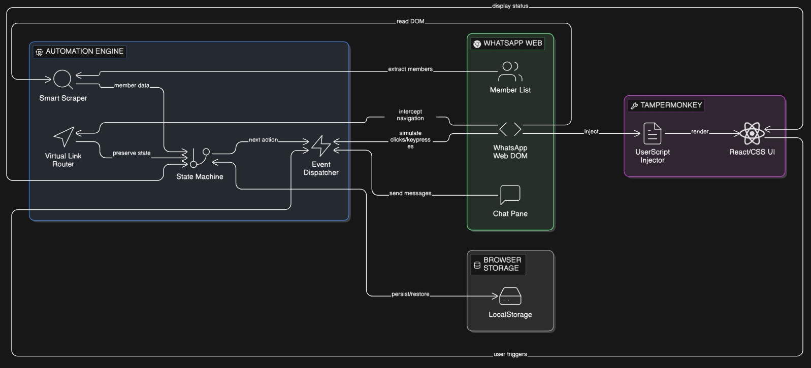

# WA Mass Sender Pro (2026)

A high-performance, browser-native automation engine for WhatsApp Web, engineered to bypass SPA navigation hurdles and automate lead outreach with human-like behavior.

> **Technical Showcase:** This repository serves as an architectural overview. The core source code is proprietary.

---

## 🏗 System Architecture


## 🛠 Engineering Highlights
* **Virtual SPA Router:** Overcomes "Hard Refresh" limitations by intercepting internal React routing via hidden DOM triggers.
* **Smart Scraper Engine:** Uses a sandboxed DOM-cloning approach to isolate group member lists while ignoring the main chat pane.
* **Persistence Layer:** Implements a state machine using `localStorage` to ensure sequences resume after accidental tab closures.
* **Event Dispatcher:** Solves the "Draft-only" bug using a dual-trigger system (ARIA-label targeting + KeyboardEvent dispatches).

## 📸 UI Preview


## 💻 Technical Logic (Snippets)
To demonstrate the engineering behind the tool, here are the core logic patterns:

### 1. Regex Number Extraction
```javascript
const matches = rawText.match(/\+?\d[\d\s-]{8,14}\d/g) || [];
const cleanNumbers = [...new Set(matches.map(n => n.replace(/[\s-]/g, '')))];
